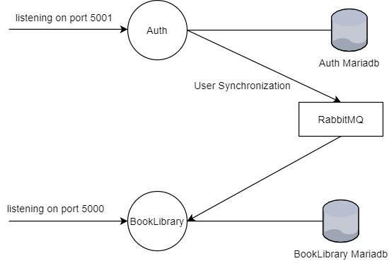

[](https://travis-ci.com/naitikmalaviya/book-library)


## Getting Started
This project follows Microservice architecture. This project contains two Dotnet microservices which uses RabbitMQ as Message-Broker tool and Mariadb for data persistency.

### Prerequisites

- Docker
- docker-compose

### Steps

- Run docker-compose file from root directory. This should build and create 4 containers. (auth, book-library, rabbitmq, mariadb).  After this step `http://localhost:5000/swagger` and `http://localhost:5001/swagger` should be accessible from browser.

  ```shell
  docker-compose up -d
  ```

- Go to `Mariadb` directory and run `populate-data.sh` file which will populate data in Mariadb.

  ```bash
  ./populate-data.sh
  ```


### Architecture

------




Dependency Injection (DI) software design pattern is followed in both dotnet service code.

**Auth Service:**  All user related operations (Create User) and authentication related operations (Generate JWT token, Generate user password hash) should be in Auth service. At user creation time, Auth service creates user and sends message with user data in RabbitMQ queue so other microservices can also sync their User tables and add this new user.

**BookLibrary Service:** All book related operations (Create book, Mark book as favorite, Write review of book) should be in BookLibrary Service. 

**Authentication:** JWT token authentication is used in this project. Only Auth service generates token at authentication time and both service can verify token using secret key added in appsettings.json file. 

**Used Libraries:**

- **BCrypt**: For one-way password hashing
- **Mysqlconnector:** For DB connection from dotnet code.
- **Dapper:** Micro ORM, used for object mapping from DB query result to dotnet objects.
- **Polly:** To implement retry policy for RabbitMQ receiver connection.
- **RabbitMQ.Client:** For RabbitMQ connection from dotnet code.
- **Swashbuckle.AspNetCore:**  To generate UI API documentation.


### Can be Improved

------

- In current dotnet code, DB root user is used access Mariadb. Ideally root user should not be used from application. Special user should be created for dotnet code and that user should be used to access DB from code.
- Database version control tool (i.e., Liquibase) should be used to track DB Stored Procedure changes and Table structure changes. Right now DB is populated directly from my local DB dump using shell script.
- Error Handling Middleware can be added to both dotnet services (Auth, BookLibrary) to catch unhandled error and return appropriate error message and error code. Right now it  is unhandled and service just returns 500 response code.
- Some Logging Provider should be configured for both dotnet  services and logging in code can be improved. Right now default dotnet console logging is used and there are no explicit logs in code. Only way to check dotnet error log is check container logs. (`docker logs auth -f`)